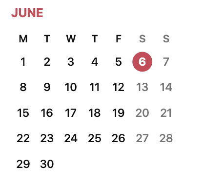
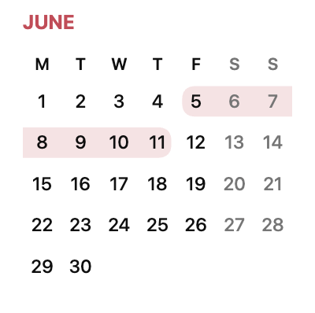
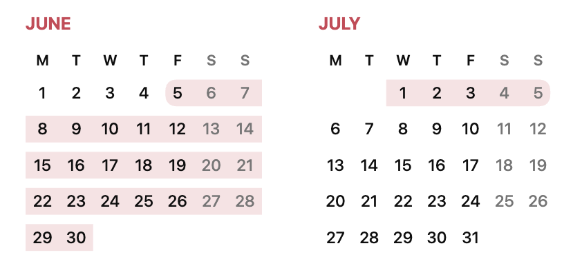
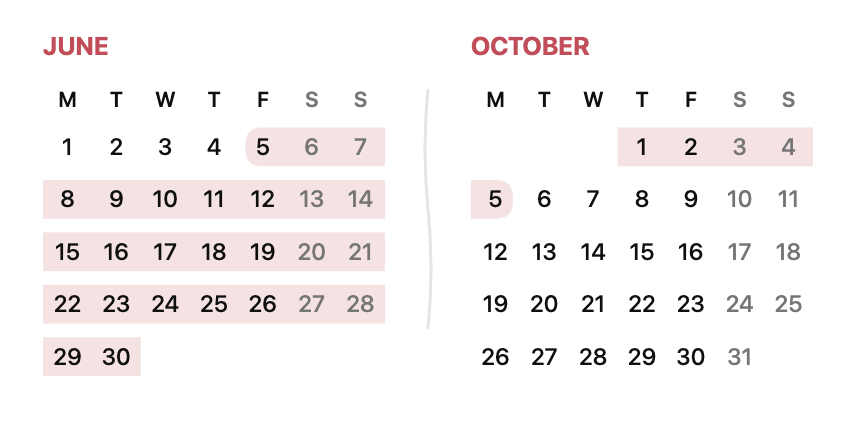

# Calendar Blocks

Calendar Blocks is an Obsidian plugin for rendering dates and date ranges as
calendars.

## Usage

Use a fenced `date` code block for a single date:

````markdown
```date
2025.07.27
```
````

The `dates` block name is supported as an alias and has identical behavior.

Use a hyphen between two dates for a range:

````markdown
```date
2025.07.27 - 2025.08.03
```
````

## Examples

### Single date

````
```date
2026.06.06
```
````



### Range within one month

````
```date
2026.06.05 - 2026.06.11
```
````



### Range across adjacent months

````
```date
2026.06.05 - 2026.07.05
```
````



### Range with omitted months

````
```date
2026.06.05 - 2026.10.05
```
````



## Settings

Use **Calendar design** to choose between the grid-based **Basic** design and
the default **Minimal** design. Minimal uses narrow weekday labels and a filled
circle for a single selected date.

Enable **Stretch calendar** in the Calendar Blocks settings to make calendars
use the full available note width. It is disabled by default, preserving the
compact layout.

## Build

```sh
npm install
npm run build
```

Copy the contents of `build/` to:

```text
<vault>/.obsidian/plugins/calendar-blocks/
```

Then reload Obsidian and enable **Calendar Blocks** in the community plugins
settings.
